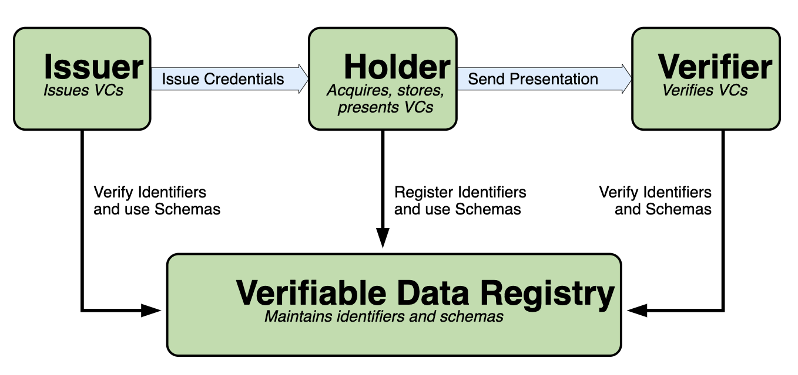
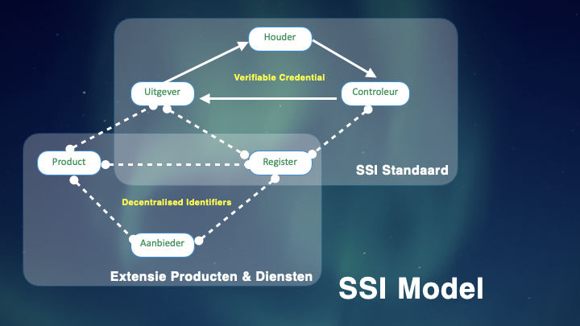

# SSI Infrastructuur

In discussies met het programma Regie op Gegevens en TWI/IGS en de overwegingen van BZK in de migratie naar de Europese eID-standaard is het concept van Self Sovereign Identity (SSI) aangeslagen. De Europese Commissie wil ook SSI-principes toepassen in het eID-stelsel en onderzoekt dat momenteel via het ESSIF-project.

De SSI-standaarden Decentralised Identifiers (DIDs) en Verifiable Credentials (VCs) zijn vrij jong (2019) maar geven goede handvatten om regie op gegevens bij de burger te faciliteren, zowel in technische als in bestuurlijke zin.

Het [basisprincipe van SSI](https://vimeo.com/463455609/460ce4093c) is dat een digitale identiteit onafhankelijk van een autoriteit door een individu of bedrijf kan worden aangemaakt (vandaar een DID), en dat de waarde van die identiteit wordt bepaald met digitale attributen (VCs) die aan die digitale identiteit door anderen worden toegekend.

Op het moment dat een burger een dienst wil afnemen van een publieke of private partij, zal die partij kunnen vragen om een bepaald attribuut van zijn digitale identiteit te delen. De waarde van dat attribuut is een functie van het type en de reputatie van de uitgever van dat attribuut. Dit attribuut kan dan digitaal geverifieerd worden via een register, waar alle partijen met hun DID in staan vermeld. Na deze verificatie kan de dienst worden verleend, conform de voorwaarden die de dienstverlener stelt, zoals welke VCs gedeeld en geverifieerd moeten worden om de betreffende dienst te kunnen verlenen. De verificatie kan onafhankelijk van de oorspronkelijke uitgever van het attribuut gedaan worden, wat niet alleen privacy beschermend is, maar ook veel efficiënter in termen van controlemechanismen. Zoals de term DID suggereert is het stelsel dus decentraal, wat betekent dat er geen centrale autoriteit nodig is om het stelsel te laten werken. Het is wel zo dat de waarde van de attributen wordt bepaald door de reputatie van de uitgever ervan, in het SZW-domein zijn dat vooralsnog (centrale) overheidspartijen.

Bovenstaand plaatje geeft een [overzicht](https://vimeo.com/487150632/bdd51faaee) van het basisprincipe van SSI. De uitgever ( *Issuer* ) geeft een attribuut (credential) uit aan een houder ( *Holder* , een individu of bedrijf), die dat attribuut deelt in een transactie met een partij die het attribuut wil controleren ( *Verifier* ) op geldigheid. Dat gebeurt allemaal digitaal aan de hand van DIDs van alle partijen en attributen via een register ( *Verifiable Data Registry* ). Dat register is ook decentraal van opzet, zoals een *blockchain* of een ander soort  *distributed ledger* , zoals een gerepliceerde database.

Deze relatief eenvoudige opzet maakt recursiviteit mogelijk; een uitgever moet bijvoorbeeld zelf ook attributen kunnen delen met controleurs of zij gerechtigd is om een bepaald attribuut uit te mogen geven. Zo kan een fijn netwerk ontstaan van partijen die met elkaar attributen kunnen delen om zo elkaars reputatie te bevestigen en die in elke stap van de transactie ook van rol kunnen wisselen. De burger die bijvoorbeeld een attribuut wil gaan delen met een partij kan op haar beurt die partij willen controleren op zijn attributen op basis waarvan die partij meent te mogen vragen om dat burgerattribuut te delen met hem.

## SSI in het Sociaal Domein

Voorgaande abstractie vertaalt zich in concrete transactionele processen in het sociaal domein. Een bijstandsgerechtigde met tijdelijk werk is verplicht om op grond van de Participatiewet wijzigingen in inkomen door te geven, door elke maand een loonstrook te overleggen. Met deze gegevens berekent de gemeente de aanvullende uitkering en betaalt die vervolgens uit. Dit is een transactioneel proces, dat volgens het basisprincipe van SSI start met het delen van attributen (BSN, Loonstrook) door de burger met de gemeente die als attribuut de “Uitvoering van de Participatiewet” heeft, en daarvan het onderdeel “informatieplicht voor attributen x, y, z” zou moeten delen, ter controle door de burger. In praktijk is het voldoende dat de burger kan controleren dat zij met de gemeente te maken heeft (attribuut overheidsorganisatie/gemeente) om er zeker ervan te zijn dat zij haar eigenen attributen rechtmatig kan delen voor dat specifieke proces.

Een ander voorbeeld gaat over het vinden en behouden van werk. Met de SSI-methode kan een burger zijn CV samenstellen aan de hand van een verzameling van werkervaring-attributen, die idealiter door een geverifieerde werkgever aan hem zijn uitgereikt, momenteel referenties genoemd. Het CV wordt doorgaans uitgebreid met opleiding-attributen die door opleidingsinstituten worden uitgereikt. Op deze manier kan de *Career Wallet* worden gevuld, waaruit de burger zijn werkgerelateerde attributen kan delen in de communicatie met een potentiële werkgever of gemeente/UWV, als hij meer hulp nodig heeft in het vinden van een baan. De pilots in het Werkdomein gaan vooral over dat laatste, waarbij de gemeente/UWV moet kunnen controleren of bepaalde werkervaring inderdaad is opgedaan om de burger verder te kunnen helpen met trainingen en instrumenten om competenties op niveau te brengen. Ook hier kunnen we recursiviteit zien door een opleiding-attribuut zoals een gevolgde training of gebruikt instrument te koppelen aan een aanbieder, die zelf een reputatie heeft aan de hand van attributen die hij op zijn beurt heeft opgebouwd. Het eerder plaatje kan dan als volgt worden uitgebreid:

## Uitbreiding

De essentie is dat dit SSI-model zelf ook recursief is in de zin dat er via het register DIDs van uiteenlopende aard aan elkaar kunnen worden gelinkt. Zo kan een werkgever uit het laatste voorbeeld het opleiding-attribuut van de burger, uitgegeven door de gemeente/UWV, controleren door uit dit attribuut de DIDs van het type opleiding (Product) en de aanbieder te verifiëren via het register, inclusief de reputatie-attributen van de aanbieder, indien die ze ter beschikking stelt. Zo kan via een enkel attribuut een complete *audittrail* worden gevolgd om de controleur comfort te geven.

Als elke entiteit (Persoon, Organisatie, Product) met een DID wordt geregistreerd is het verantwoordingsproces van de gegevensuitwisseling daarmee ook eenvoudiger en transparanter te maken.
